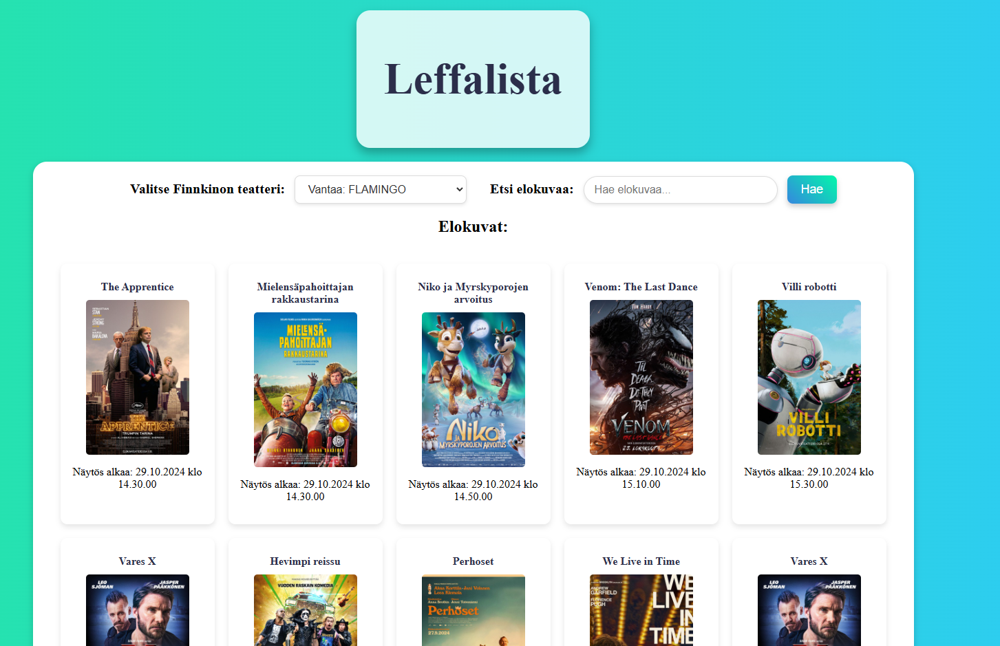

# Projekti 2a: AJAX-sovellus REST APIa hyödyntäen
Leffalista. Tekijät Teemu Markus ja Jenni Koivisto.

## Demo link:
Pääsy sivulle tämän linkin kautta --> [Leffalista](https://leffalista.netlify.app/)

## Työnjako
Koodin kirjoitus jaettiin aikalailla 50/50. Kun kaikki tarvitta tiedonhaku oli tehtynä lähdimme yhdessä kirjoittamaan koodia, teimme molemmat muutoksia koodiin vuoron perään, sillä tämä ohjelma ei ihan ensimmäisellä yrittämällä lähtenyt toimimaan.Teemu käytti aikaa API avaimen hakuun, jotta saatiin ohjelma toimivaksi Open Movie databasen kanssa. Jenni puolestaan tällä välillä käytti aikaa ohjelman tyylittelyyn käyttäen css:ää.

Tekijöiden projektiin käyttämä aika tunteina:
    - Teemu 6.5h
    - Jenni 6h

## About The App
Leffalista on sovellus, jossa käyttäjä voi etsiä elokuvia, jotka pyörivät Finnkinon teatteriessa tällä hetkellä. Käyttäjä voi myös käyttää ohjelmassa elokuvan haku kohtaa etsimään jotain tiettyä elokuvaa Open Movie tietokannasta, vaikka kyseinen elokuva ei pyörisikään Finnkinon teattereissa. 
Tämä sovellus mahdollistaa käyttäjän siis etsimään elokuvia, joita mennä katsomaan teattereissa tai mielenkiintoisa elokuvia, joita katsoa etsiä sitten vaikka jonkin suoratoistopalvelun kautta katsottavaksi.

## Screenshot

## Teknologiat
Tässä projektissa käytetyt teknologiat:
    - HTML
    - CSS
    - Javascript

## Setup
Sovellus on julkaistu Netlify palvelussa ja sovelluksen saa auki Demo Link kohdasta.

## Status
Sovellus on valmis.

## Credits
Tämän sovelluksen tekemisessä on hyödynnetty ChatGPT:tä koodin korjaamiseen sekä parantamiseen.

